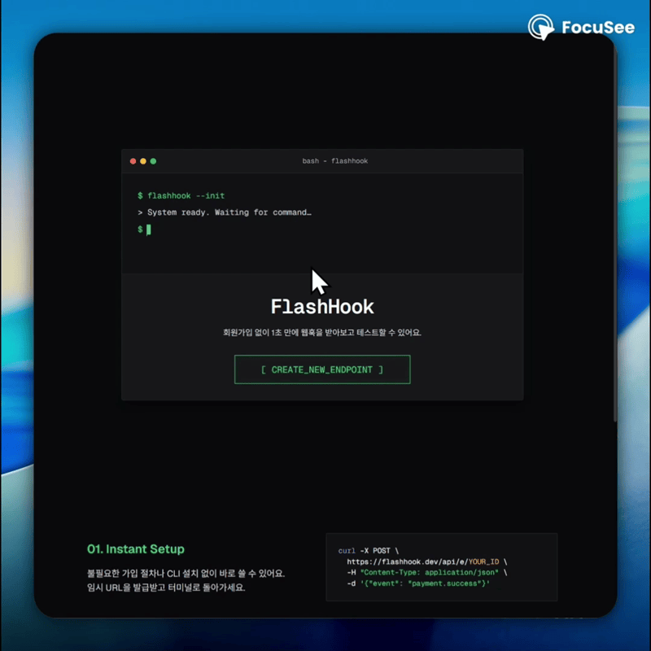
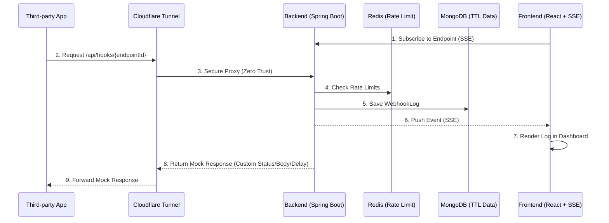

<div align="center">

# ⚡ FlashHook

**1초 만에 생성하는 개발자용 웹훅 샌드박스 및 Mock API 서비스**

[](https://github.com/pottq577/flashhook/actions/workflows/ci.yml)
[](https://myhits.vercel.app)

\

[](https://github.com/pottq577/flashhook/commits/main)

<br/>

<p><em>회원가입 없이 웹훅 주소를 즉시 발급받고, 들어오는 요청을 실시간으로 확인하세요.
<br/>토스나 카카오 결제 웹훅까지 실제와 똑같이 재현됩니다.</em></p>

</div>

---

## 지금 바로 사용하기

[](https://flashhook.site)

## 기획 배경

### Problem

토스페이먼츠나 카카오 로그인 같은 외부 API를 연동할 때, 한 번쯤 이런 불편함을 겪어보셨을 거예요.

1. 상대방이 보내는 웹훅 데이터 형식을 보려면 매번 `ngrok`으로 로컬 포트를 열거나 테스트 서버를 배포해야 해요.
2. 타사 API가 점검 중이거나 타임아웃이 났을 때 내 서버가 잘 버티는지 테스트하고 싶은데, 진짜 서버를 고의로 망가뜨릴 방법이 없어요.

### Solution

그래서 누구나 **클릭 한 번으로 임시 URL을 발급받아 데이터를 실시간으로 확인**하고, **"이 URL은 잠시 뒤에 에러를 뱉어줘"라고 조작할 수 있는 가짜 서버**를 만들었어요.

## 핵심 기능

### 1. Webhook Catcher

> **"상대방이 나한테 정확히 어떤 데이터를 보내고 있는 걸까?"**

- **활용 예시**: 결제 성공 시 날아오는 JSON 구조를 정확히 파악해서 파싱 코드를 작성하고 싶을 때.
- **워크플로우**: 임시 웹훅 URL 생성 → 외부 서비스에 수신지 등록 → 대시보드에서 Payload, Headers, Query를 실시간 확인.

### 2. K-API Mock

> **"상대방 서버에 문제가 생기면 내 서버는 안 터지고 잘 버틸 수 있을까?"**

- **활용 예시**: 카카오 로그인 서버가 지연되거나 실패할 때, 내 서버의 타임아웃/에러 처리를 검증하고 싶을 때.
- **워크플로우**: 프리셋 또는 수동 Mock 설정 → 호출 URL을 FlashHook 주소로 변경 → 원하는 상태 코드, 지연, 본문으로 응답 확인.

**국내외 주요 서비스 6종의 공식 응답 스펙을 그대로 재현하는 프리셋을 제공해요.**
_(공식 문서 기반 제공, 스펙 불일치 시 원클릭 이슈 제보 지원)_

| 서비스           | 테스트 가능한 시나리오                                                            |
| ---------------- | --------------------------------------------------------------------------------- |
| **카카오**       | OAuth 토큰 발급 성공/실패, `invalid_client`, `invalid_grant`, 응답 지연 (3s / 5s) |
| **토스페이먼츠** | 결제 성공, 이미 처리된 결제, 잔액 부족, 한도 초과, 응답 지연                      |
| **포트원 V2**    | 결제 성공/실패, 웹훅 서명 자동 생성 후 Replay 발송                                |
| **솔라피**       | SMS 발송 성공/실패, 잔액 부족                                                     |
| **GitHub**       | `X-Hub-Signature-256` 서명 자동 생성 후 Replay 발송                               |
| **Slack**        | URL Verification `challenge` 자동 응답                                            |

### 3. Replay API

> **"로컬 서버가 꺼져있을 때 들어온 웹훅을 나중에 다시 테스트해 볼 순 없을까?"**

- **활용 예시**: 터널링이 끊겨 웹훅을 놓쳤을 때, 동일한 페이로드를 로컬 서버로 다시 보내 디버깅하고 싶을 때.
- **워크플로우**: 과거 로그 선택 → 재전송 대상 URL 입력 → FlashHook이 저장된 요청을 다시 발송.

## 아키텍처



- **Backend:** Java 21, Spring Boot 4.0.7
- **Frontend:** React 19, TypeScript, Vite, Zustand, TanStack Query, React Router, Framer Motion, Playwright + Axe, FSD 아키텍처
- **Database:** MongoDB TTL, Redis
- **Infra:** Docker, SSE, Cloudflare Tunnel (Zero Trust)

자세한 구조는 [System Context](docs/artifacts/CONTEXT.md)와 [System Architecture](docs/artifacts/04_system_architecture.md)를 참고해 주세요.

## 기술적 챌린지

### Backend

- **트래픽 남용 방지**: 회원가입 없이 URL을 만들 수 있어 요청 빈도 제한과 프록시 환경의 클라이언트 IP 해석을 함께 설계했어요.
- **스토리지 보호**: 비정형 웹훅 로그가 무한히 쌓이지 않도록 TTL과 앱 레벨 저장량 제한을 적용했어요.
- **수신/브로드캐스트 분리**: 웹훅 수신 경로와 SSE 전송 경로를 비동기 이벤트로 분리해 지연 전파를 줄였어요.
- **동적 응답 프리셋**: Slack, GitHub, PortOne처럼 요청 파싱이나 서명 처리가 필요한 프리셋을 전략 패턴으로 분리했어요.
- **Replay SSRF 방어**: 외부 발송 전 목적지 주소를 검증하고 내부망 접근과 DNS Rebinding 위험을 차단했어요.

### Frontend

- **Polling 없는 실시간 로그**: EventSource 기반 SSE 연결로 수신 즉시 대시보드에 로그를 반영해요.
- **대량 로그 렌더링 최적화**: 가상화 리스트로 많은 로그가 쌓여도 UI가 멈추지 않게 했어요.
- **상태 관리 분리**: FSD 구조, Zustand, TanStack Query로 UI 상태와 서버 상태를 분리했어요.
- **자동화된 품질 검증**: Playwright와 Axe로 주요 흐름과 접근성 회귀를 검사해요.

### Load Test & Reliability

- **오버엔지니어링 없는 목표 성능 달성**: 비동기 EventPublisher 구조를 통해 단일 인스턴스 톰캣 서버만으로 당초 목표치인 500 TPS를 넘어 **최대 600 TPS** (8분간 총 13만 3천 건)의 대규모 웹훅 수신을 큐 적체 현상 없이 평균 8.29ms 이내에 안정적으로 소화함을 실측했습니다.
- **대규모 실시간 연결 유지**: 500개의 SSE 커넥션이 연결된 상태에서 다량의 이벤트가 유입되는 고부하 상황에서도, 송신된 이벤트가 트래픽 종료 후 100% 도달하며 단 1건의 커넥션 드랍이나 유실 없이 안정적으로 스트림을 유지함을 검증했습니다.
- **악의적 트래픽 억제**: 웹훅 수신, 엔드포인트 생성 및 Replay 전반에 Rate Limit 방어선을 구축하여, 인가되지 않은 대량의 웹훅 수신(분당 100건 초과)이나 엔드포인트 대량 생성 시도시 한도 초과분을 즉각 차단(`429 Too Many Requests`)하여 시스템 오버헤드를 방어했습니다.

### 품질 최적화

- **SEO & 웹 성능 최적화**: 히어로 이미지 우선 로딩(`fetchpriority="high"`) 및 폰트 프리로드를 통해 LCP를 개선하고, 다국어 타겟팅 및 OpenGraph, JSON-LD 동적 삽입을 통한 SEO/GEO 최적화를 적용했어요.
- **UI/UX 개선**:
  - 자연스러운 화면 전환 애니메이션 최적화 (`300ms ease-out cubic-bezier`)
  - 고정폭 숫자 서체(`tabular-nums`) 적용으로 동적 데이터 렌더링 시 레이아웃 Jitter 방지
  - Fitts's Law에 의거한 인터랙티브 클릭 타겟 크기 확보 (최소 32px)
  - 다크/라이트 테마에 반응하는 부드러운 그림자 효과로 시각적 계층 구조 강화

보안 설계는 [Security Overview](docs/security/SECURITY_OVERVIEW.md), 더 자세한 설계 의도는 [System Context (EN)](docs/artifacts/CONTEXT.md) 또는 [System Context (KR)](docs/artifacts/CONTEXT_KR.md)를 참고해 주세요.

## 데이터 보존 및 개인정보 안내

FlashHook은 장기 보관 서비스가 아니라 임시 디버깅 도구예요.

- 엔드포인트와 로그는 생성 후 24시간이 지나면 자동으로 삭제돼요.
- 대시보드에서 엔드포인트와 로그를 직접 삭제할 수 있어요.
- 웹훅 Payload에 제3자 개인정보가 섞일 수 있어요. 테스트 데이터를 쓰는 걸 권장해요.

자세한 기준은 [개인정보처리방침](docs/legal/PRIVACY_POLICY.md)과 [서비스 이용약관](docs/legal/TERMS_OF_SERVICE.md)을 참고해 주세요.

## 로컬 개발 환경

1. 인프라 실행

```bash
docker-compose up -d
```

2. 백엔드 실행

```bash
cd FH_backend
./gradlew bootRun
```

3. 프론트엔드 실행

```bash
cd FH_frontend
npm install
npm run dev
```

4. 브라우저에서 `http://localhost:5173` 접속

자세한 개발 환경 구성은 [Development Guide](docs/DEVELOPMENT.md)를 참고해 주세요.

## 문서 모음

| 문서                                                              | 설명                              |
| ----------------------------------------------------------------- | --------------------------------- |
| [Product & Features](docs/artifacts/01_product_and_features.md)   | 제품 목표와 핵심 기능             |
| [Mock API Features](docs/artifacts/02_mock_api_features.md)       | K-API Mock 프리셋 설계            |
| [K-API Presets Spec](docs/artifacts/03_kapi_presets_ssot.md)      | 6대 K-API 공식 웹훅 명세 (SSOT)   |
| [System Architecture](docs/artifacts/04_system_architecture.md)   | 시스템 구조와 데이터 흐름         |
| [API Spec](docs/artifacts/05_api_spec.md)                         | API 엔드포인트와 요청/응답 스키마 |
| [Error Dictionary](docs/artifacts/06_error_dictionary.md)         | 공통 에러 코드                    |
| [Load Test Limits](docs/artifacts/07_load_test_limits.md)         | 시스템 한계치 및 부하 테스트 결과 |
| [Security Overview](docs/security/SECURITY_OVERVIEW.md)           | 공개 가능한 보안 설계 개요        |
| [Development Guide](docs/DEVELOPMENT.md)                          | 로컬 개발 및 검증 가이드          |
| [ADR 0001](docs/adr/0001-preset-catalog-lives-in-fe-constants.md) | 프리셋 카탈로그 위치 결정         |
| [ADR 0002](docs/adr/0002-dynamic-preset-split-into-two-types.md)  | 동적 프리셋 타입 분리 결정        |
| [ADR 0003](docs/adr/0003-preset-drift-mitigation-strategy.md)     | Mock 프리셋 스펙 불일치 완화 전략 |
| [ADR 0004](docs/adr/0004-two-layered-exception-handling.md)       | 2-Layered 예외 처리 전략          |
| [Privacy Policy](docs/legal/PRIVACY_POLICY.md)                    | 개인정보처리방침                  |
| [Terms of Service](docs/legal/TERMS_OF_SERVICE.md)                | 서비스 이용약관                   |
| [License](LICENSE)                                                | 라이선스                          |

## 라이선스

프로젝트의 [LICENSE](LICENSE)는 MIT License예요.

## 문의/이슈

버그 제보, 개선 제안, 질문은 [GitHub Issues](https://github.com/pottq577/flashhook/issues) 또는 [Google Form](https://forms.gle/fu21EPmxTu3h9Pob8)에 남겨주세요.
