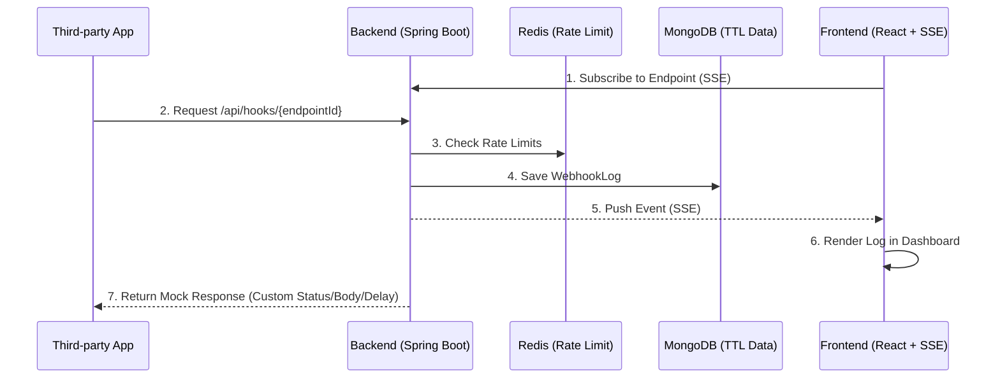

<div align="center">

# ⚡ FlashHook

**1초 만에 생성하는 개발자용 웹훅 샌드박스 및 Mock API 서비스**

[](https://flashhook.site)

[](https://github.com/pottq577/flashhook/actions/workflows/ci.yml)
[](https://myhits.vercel.app)
\

[](https://github.com/pottq577/flashhook/commits/main)

FlashHook은 회원가입 없이 바로 쓸 수 있는 엔드포인트를 제공해서,<br/>
들어오는 웹훅 데이터를 실시간으로 확인하고 외부 API의 예외 응답을 직접 테스트해 볼 수 있는 유틸리티예요.

</div>

---

## 📸 Demo

> **[TODO] 대시보드 실시간 수신 화면이나 Mock 세팅 화면 GIF**

---

## 🤔 기획 배경

### Problem

토스페이먼츠나 카카오 로그인 같은 외부 API를 연동할 때, 한 번쯤 이런 불편함을 겪어보셨을 거예요.

1. 상대방이 보내는 웹훅 데이터 형식을 보려면 매번 `ngrok`으로 로컬 포트를 열거나 테스트 서버를 배포해야 해요.
2. 타사 API가 점검 중이거나(`500 Error`) 타임아웃이 났을 때 내 서버가 잘 버티는지 테스트하고 싶은데, 진짜 서버를 고의로 망가뜨릴 방법이 없어요.

### Solution

그래서 누구나 **클릭 한 번으로 임시 URL을 발급받아 데이터를 실시간으로 확인**하고, **"이 URL은 10초 뒤에 500 에러를 뱉어줘"라고 조작할 수 있는 가짜 서버**를 만들었어요.

---

## 🚀 주요 기능 및 워크플로우

### 1. Webhook Catcher (요청 수신 및 로깅)

> **"상대방이 나한테 정확히 어떤 데이터를 보내고 있는 걸까?"**

- **활용 예시**: 토스페이먼츠 결제 성공 시 날아오는 JSON 구조를 정확히 파악해서 파싱 코드를 작성하고 싶을 때.
- **워크플로우**:
  1. 임시 웹훅 URL을 발급받아요.
  2. 토스 개발자 센터에 웹훅 수신지로 등록해요.
  3. 대시보드에 실시간으로 찍히는 JSON 페이로드와 헤더를 확인하고 복사해요.

### 2. K-API 프리셋 Mock API (응답 제어 및 조작)

> **"상대방 서버에 문제가 생기면 내 서버는 안 터지고 잘 버틸 수 있을까?"**

- **활용 예시**: 카카오 로그인 서버가 10초 이상 지연될 때, 우리 서버가 타임아웃 처리를 정상적으로 하는지 검증하고 싶을 때.
- **워크플로우**:
  1. 대시보드에서 **[카카오 로그인 - 500 서버 장애]** 프리셋을 선택해요 (수동 설정도 가능해요).
  2. 내 로컬 코드의 API 호출 URL을 FlashHook 주소로 잠깐 바꿔요.
  3. 내 서버에서 요청을 보내면 FlashHook이 지정된 시간 뒤에 에러 응답을 반환해요. 내 서버가 에러를 잘 다루는지 확인해요.
  4. Slack URL Verification처럼 수신된 파라미터(`challenge`)를 파싱하여 동적으로 응답을 반환하는 고급 프리셋도 지원해요.

---

## 🏛 아키텍처 및 시스템 설계



- **Backend:** Java 21, Spring Boot 3.5.15
- **Frontend:** React 19, TypeScript, Vite, Zustand, TanStack Query(v5), React Router DOM(v7), Framer Motion, Playwright + Axe, FSD 아키텍처
- **Database:** MongoDB (TTL), Redis (Rate Limit)
- **Infra:** Docker, SSE (Server-Sent Events)

자세한 시스템 구조는 [`docs/artifacts/CONTEXT.md`](docs/artifacts/CONTEXT.md)를 참고해 주세요.<br/>
API 명세는 [`docs/artifacts/04_api_spec.md`](docs/artifacts/04_api_spec.md)를 참조해 주세요.<br/>
특히 도메인 간(`WebhookService`와 `SseEmitterService`) 결합도를 낮추고 성능 향상을 위해 **Spring ApplicationEvent (@Async)** 기반의 비동기 이벤트 드리븐 패턴을 적용했습니다.

---

## 💡 기술적 챌린지와 해결 과정

안정적인 트래픽 방어와 실시간 렌더링 성능을 확보하기 위해 프론트엔드와 백엔드 전반에 걸쳐 다음과 같은 아키텍처를 설계하고 적용했습니다.

### 🏢 Backend (Spring Boot)

#### 1. 무분별한 요청 폭주(DDoS) 방어 및 Proxy-Aware IP Spoofing 차단

- **문제**: 가입 없이 누구나 URL을 생성할 수 있어 매크로 공격에 노출되기 쉬우며, 로컬 터널(Cloudflare)이나 리버스 프록시(Nginx)를 거칠 경우 모든 접속이 단일 프록시 IP로 식별되어 Rate Limit이 전역적으로 걸려버리는 오작동 문제가 있었습니다. 반대로 클라이언트가 `X-Forwarded-For` 헤더를 위조해 IP를 속일(Spoofing) 위험도 공존했습니다.
- **해결**: Redis의 **고정 윈도우(Fixed Window) 카운터 알고리즘**을 도입하여 즉각적인 Rate Limit(IP당 생성 제한, 엔드포인트당 수신 제한)을 적용했습니다. 또한 Spring Boot의 **내장 프록시 신뢰 메커니즘(`forward-headers-strategy: framework`)**을 구성하여, 서버가 신뢰하는 내부 프록시(Internal Proxies)를 거친 요청에서만 안전하게 실제 클라이언트 IP를 추출하도록 아키텍처를 개선했습니다. 이를 통해 터널 환경에서도 정확한 개별 IP 카운팅이 가능하며, 동시에 악의적인 헤더 조작(IP Spoofing)을 프레임워크 단에서 완벽히 차단합니다.

#### 2. 비정형 가비지 데이터 무한 적재 방지 (DB 스토리지 보호)

- **문제**: 다양한 형태의 무작위 웹훅 로그가 무한정 쌓일 경우 DB 용량이 빠르게 고갈됩니다.
- **해결**: 다양한 페이로드를 담기 위해 NoSQL인 MongoDB를 채택했으며, **TTL(Time-To-Live) 인덱스**를 활용해 24시간이 지난 데이터는 스케줄링 서버 없이도 DB 엔진 단에서 백그라운드 자동 파기되도록 설계했습니다. 추가로 앱 레벨에서 단일 엔드포인트당 최대 500건/5MB 초과 시 가장 오래된 로그를 덮어쓰는 **환형 큐(Circular Queue)** 제어를 구현했습니다.

#### 3. 웹훅 수신과 클라이언트 브로드캐스팅의 결합도 분리

- **문제**: 수많은 클라이언트에게 실시간으로 SSE를 전송(Push)하는 작업이 지연될 경우, 웹훅을 수신하는 메인 스레드까지 블로킹될 위험이 있었습니다.
- **해결**: Spring `ApplicationEvent`와 `@Async`를 결합한 **비동기 이벤트 드리븐(Event-Driven)** 방식으로 아키텍처를 재설계했습니다. 이를 통해 웹훅 수신(1ms 이내 반환) 로직과 SSE 푸시 로직을 완벽히 분리하여 서버 처리량을 극대화했습니다.

#### 4. 서드파티 동적 응답(Mock) 지원 및 SSRF 공격 방어

- **문제**: Slack 이벤트 구독처럼 요청 본문을 파싱해 특정 값(`challenge`)을 즉각 반환해야 하는 동적 웹훅 대응이 필요했으며, 악의적인 URL 등록으로 내부망을 공격(SSRF/DNS Rebinding)할 위험이 있었습니다.
- **해결**: `presetType` 기반 팩토리 패턴을 도입해 요청을 동적으로 파싱하고 조립하는 핸들러를 구현했습니다. 또한 외부망 접근 시 커스텀 `SimpleClientHttpRequestFactory`를 적용해 **사설 IP 대역(Private IP)으로의 접근을 원천 차단**하여 보안을 확보했습니다.

### 🎨 Frontend (React / Vite)

#### 1. 폴링(Polling) 없는 실시간 데이터 스트리밍 파이프라인

- **문제**: 웹훅 도착 여부를 HTTP 폴링으로 확인하면 불필요한 네트워크 트래픽과 지연이 발생합니다.
- **해결**: 네이티브 `EventSource`를 활용해 **SSE(Server-Sent Events)** 단방향 스트리밍을 구현했습니다. 네트워크 단절 시 자동 재연결 로직과 클린업을 담당하는 커스텀 훅을 작성하여 실시간 디버깅 경험을 제공합니다.

#### 2. 대량의 로그 렌더링 시 DOM 프리징(Freezing) 방지

- **문제**: 수백 건의 웹훅 로그가 짧은 시간에 쏟아질 경우, 렌더링 부하로 인해 브라우저가 멈추는 현상이 발생할 수 있습니다.
- **해결**: `react-virtuoso`를 도입하여 **가상화(Virtualization) 리스트 렌더링**을 적용했습니다. 화면에 노출되는 요소만 렌더링함으로써 500건 이상의 로그가 쌓여도 60FPS의 부드러운 스크롤 성능을 유지합니다.

#### 3. FSD 아키텍처 기반의 복잡한 상태 관리와 캐싱

- **문제**: 실시간 연결 상태, 선택된 엔드포인트, 누적되는 로그 데이터 등 복잡한 상태를 여러 컴포넌트 간에 안전하게 공유해야 했습니다.
- **해결**: **FSD(Feature-Sliced Design)** 아키텍처를 도입하여 컴포넌트 간 결합도를 최소화했습니다. `Zustand`를 활용해 전역 상태를 관리하고, `TanStack Query`로 서버 상태 및 데이터 캐싱을 깔끔하게 분리하여 유지보수성을 높였습니다.

#### 4. 자동화된 E2E 파이프라인과 웹 접근성(A11y) 확보

- **문제**: 실시간 UI 변화가 잦은 애플리케이션 특성상 회귀 버그 발생 위험이 높고, 웹 접근성이 누락되기 쉽습니다.
- **해결**: `Playwright`를 이용해 총 36개의 E2E 테스트 케이스를 구축하여 핵심 워크플로우를 자동 검증합니다. 동시에 `@axe-core/playwright`를 통합해 렌더링되는 모든 뷰의 **웹 접근성을 자동 검사**하여 높은 품질을 유지합니다.

---

## ⚡ 빠른 시작

1. 인프라 실행 (Redis, MongoDB)

```bash
docker-compose up -d
```

2. 백엔드 및 프론트엔드 구동

```bash
# 백엔드 실행 (새 터미널 탭)
cd FH_backend
./gradlew bootRun

# 프론트엔드 실행 (새 터미널 탭)
cd FH_frontend
npm install
npm run dev
```

3. (선택) Cloudflare Tunnel 등으로 로컬 포트 외부 노출

```bash
cloudflared tunnel --url http://localhost:8080
```

4. `http://localhost:5173` 접속하여 로컬 샌드박스 환경 테스트 완료!
