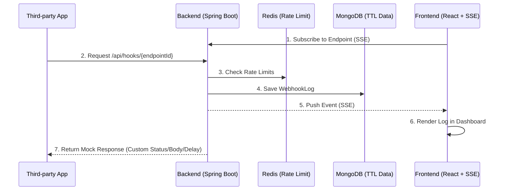

<div align="center">

# ⚡ FlashHook

**1초 만에 생성하는 개발자용 웹훅 샌드박스 및 Mock API 서비스**

[](https://github.com/pottq577/flashhook/actions/workflows/ci.yml)
[](https://myhits.vercel.app)


FlashHook은 회원가입 없이 바로 쓸 수 있는 엔드포인트를 제공해서,<br/>
들어오는 웹훅 데이터를 실시간으로 확인하고 외부 API의 예외 응답을 직접 테스트해 볼 수 있는 유틸리티예요.

</div>

---

## 📸 Demo

> **[TODO] 대시보드 실시간 수신 화면이나 Mock 세팅 화면 GIF**

---

## 🤔 기획 배경

### Problem

토스페이먼츠나 카카오 로그인 같은 외부 API를 연동할 때, 한 번쯤 이런 불편함을 겪어보셨을 거예요.

1. 상대방이 보내는 웹훅 데이터 형식을 보려면 매번 `ngrok`으로 로컬 포트를 열거나 테스트 서버를 배포해야 해요.
2. 타사 API가 점검 중이거나(`500 Error`) 타임아웃이 났을 때 내 서버가 잘 버티는지 테스트하고 싶은데, 진짜 서버를 고의로 망가뜨릴 방법이 없어요.

### Solution

그래서 누구나 **클릭 한 번으로 임시 URL을 발급받아 데이터를 실시간으로 확인**하고, **"이 URL은 10초 뒤에 500 에러를 뱉어줘"라고 조작할 수 있는 가짜 서버**를 만들었어요.

---

## 🚀 주요 기능 및 워크플로우

### 1. Webhook Catcher (요청 수신 및 로깅)

> **"상대방이 나한테 정확히 어떤 데이터를 보내고 있는 걸까?"**

- **활용 예시**: 토스페이먼츠 결제 성공 시 날아오는 JSON 구조를 정확히 파악해서 파싱 코드를 작성하고 싶을 때.
- **워크플로우**:
  1. 임시 웹훅 URL을 발급받아요.
  2. 토스 개발자 센터에 웹훅 수신지로 등록해요.
  3. 대시보드에 실시간으로 찍히는 JSON 페이로드와 헤더를 확인하고 복사해요.

### 2. K-API 프리셋 Mock API (응답 제어 및 조작)

> **"상대방 서버에 문제가 생기면 내 서버는 안 터지고 잘 버틸 수 있을까?"**

- **활용 예시**: 카카오 로그인 서버가 10초 이상 지연될 때, 우리 서버가 타임아웃 처리를 정상적으로 하는지 검증하고 싶을 때.
- **워크플로우**:
  1. 대시보드에서 **[카카오 로그인 - 500 서버 장애]** 프리셋을 선택해요 (수동 설정도 가능해요).
  2. 내 로컬 코드의 API 호출 URL을 FlashHook 주소로 잠깐 바꿔요.
  3. 내 서버에서 요청을 보내면 FlashHook이 지정된 시간 뒤에 에러 응답을 반환해요. 내 서버가 에러를 잘 다루는지 확인해요.
  4. (추가) Slack URL Verification처럼 수신된 파라미터(`challenge`)를 파싱하여 동적으로 응답을 반환하는 고급 프리셋도 지원합니다.

---

## 🏛 아키텍처 및 시스템 설계



- **Backend:** Java 21, Spring Boot 3.5.15
- **Frontend:** React 19, TypeScript, Vite, Zustand, TanStack Query(v5), React Router DOM(v7), Framer Motion, Playwright + Axe, FSD 아키텍처
- **Database:** MongoDB (TTL), Redis (Rate Limit)
- **Infra:** Docker, SSE (Server-Sent Events)

자세한 시스템 구조는 [`docs/artifacts/CONTEXT.md`](docs/artifacts/CONTEXT.md)를 참고해 주세요.<br/>
API 명세는 [`docs/artifacts/04_api_spec.md`](docs/artifacts/04_api_spec.md)를 참조해 주세요.<br/>
특히 도메인 간(`WebhookService`와 `SseEmitterService`) 결합도를 낮추고 성능 향상을 위해 **Spring ApplicationEvent (@Async)** 기반의 비동기 이벤트 드리븐 패턴을 적용했습니다.

---

## 💡 기술적 챌린지와 해결 과정

트래픽 방어와 리소스 관리를 위해 다음 아키텍처를 도입했습니다.

### 1. 무분별한 요청 폭주(DDoS/Spam)로 인한 서버 마비 방어

- **문제**: 누구나 URL을 생성할 수 있어, 악의적인 사용자가 매크로로 초당 수만 건의 웹훅을 쏠 경우 서버가 다운될 위험.
- **해결**:
  - Redis 기반 **고정 윈도우(Fixed Window) 카운터 알고리즘**을 도입하여 Rate Limit 적용
    - IP당 생성 5개/일, 엔드포인트당 수신 100건/분.
  - 제한 초과 시 `429 Too Many Requests`를 반환하여 WAS 리소스 보호.

### 2. 가비지 데이터 무한 적재로 인한 DB 스토리지 고갈

- **문제**: 비정형 웹훅 로그가 MongoDB에 대량으로 쌓이면 스토리지 비용 폭증.
- **해결**:
  - **DB 레벨 자동 파기**: MongoDB의 `TTL Index`를 활용하여 생성된 지 24시간이 지난 데이터는 스케줄링(배치) 서버 없이도 DB 엔진 단에서 백그라운드 자동 삭제.
  - **앱 레벨 스토리지 캡**: 단일 엔드포인트당 500건 또는 5MB 용량 초과 시, 가장 오래된 로그부터 덮어쓰는(Circular Queue 방식) 제어 로직 구현.

### 3. 브라우저 새로고침 없는 실시간 데이터 렌더링

- **문제**: 웹훅이 언제 들어올지 모르는 상황에서 클라이언트가 지속적으로 폴링 시 불필요한 트래픽 낭비 발생.
- **해결**:
  - Spring `@EventListener`와 **SSE**를 결합하여 단방향 실시간 푸시(Push) 파이프라인 구축.
  - 웹훅 수신 즉시 브라우저로 데이터가 스트리밍되어 실시간 디버깅 제공.

---

## ⚡ 빠른 시작

1. 인프라 실행 (Redis, MongoDB)

```bash
docker-compose up -d
```

2. 백엔드 및 프론트엔드 구동

```bash
# 백엔드 실행 (새 터미널 탭)
cd FH_backend
./gradlew bootRun

# 프론트엔드 실행 (새 터미널 탭)
cd FH_frontend
npm install
npm run dev
```

3. (선택) Cloudflare Tunnel 등으로 로컬 포트 외부 노출

```bash
cloudflared tunnel --url http://localhost:8080
```

4. `http://localhost:5173` 접속하여 로컬 샌드박스 환경 테스트 완료!
