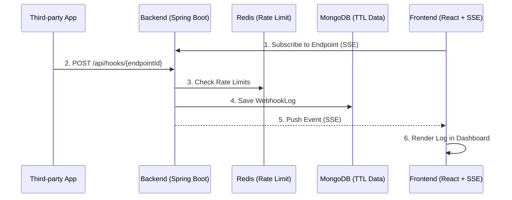

# FlashHook Context

## 1. FlashHook Domain Overview

FlashHook is a temporary webhook catcher service. It solves a specific problem: providing developers a zero-friction, 1-second process to generate a temporary endpoint URL to receive, inspect, and debug external webhooks (like payments or third-party integrations).

**Core Entities:**

- **Endpoint**: A unique URL created by a user without registration. Access to the dashboard is maintained via a temporary access token saved in the browser's `sessionStorage`. All endpoints automatically expire and are purged after 24 hours.
- **WebhookLog**: The payload received by an Endpoint. Includes headers, query params, raw body, and method. Capped at 500 logs or 5MB per endpoint, automatically expiring along with its Endpoint.

## 2. System Architecture

The system consists of a Vite/React frontend and a Spring Boot backend, utilizing MongoDB for persistence and Redis for fast caching and rate limiting.



## 3. Backend Structure (Spring Boot)

The backend uses Java 21, Spring Boot 3.5.0, and a **Package-by-Feature (Domain-Driven)** folder structure combining a 3-Layer Architecture (`controller`, `service`, `repository`) within each domain (`domain/endpoint`, `domain/webhook`).

- **Routing & Events** (The system exposes 11 API endpoints in total):
  - `EndpointController` for metadata CRUD.
  - `WebhookReceiveController` for incoming traffic.
  - `WebhookLogController` for log retrieval (using Spring Data Page with `lastSeenId` cursor) and deletion.
  - `MockResponseScheduler` generates mock HTTP responses for webhooks and returns them asynchronously via `DeferredResult` after a configured delay.
  - `WebhookStreamController` handles real-time SSE subscriptions.
- **Real-time SSE Logic**:
  - `SseEmitterService` manages connections (`ConcurrentHashMap`).
  - To prevent blocking, incoming webhooks trigger a `WebhookReceivedEvent` via Spring's `ApplicationEventPublisher`.
  - `SseEmitterService` listens via `@EventListener` and `@Async` to push payloads to connected clients.
  - A `@Scheduled` task sends a `ping` every 30 seconds (configurable via properties) to keep the connection alive through proxies.
- **Database Interaction**:
  - **MongoDB**: Primary datastore. Uses `MongoTemplate` for atomic operations (e.g., updating log counts securely) and TTL indexes for 24-hour expiration.
  - **Redis**: Handles Rate Limiting (Fixed Window via Lua scripts) and temporary caches. Follows a fail-open strategy if Redis goes down.

## 4. Frontend Structure (React/Vite)

The frontend uses React 19, TypeScript 5.7.x, and follows **Feature-Sliced Design (FSD)** to maintain strict boundaries.

- **`app/`**: Global providers (`QueryProvider`) and routing (`react-router-dom`). Includes a globally rendered `CookieBanner`.
- **`pages/`**: Main views (`LandingPage`, `DashboardPage`, `About`, `Contact`, `Terms`, `Privacy`).
- **`widgets/`**: Reusable complex blocks (`LogList`, `LogDetail`).
- **`features/`**: User interactions that span multiple entities (e.g., mock response configuration).
- **`entities/`**: Core domain logic. Uses **Zod** to validate API contracts.
- **`shared/`**: Generic UI components, API clients, and `sessionStorage` management.
- **State Management**:
  - **TanStack Query (React Query)**: Manages server state, like initial data fetching on page load.
  - **Zustand**: Manages global/real-time state, specifically the `useLogStore`. It captures new SSE events and selectively triggers re-renders for connected components, avoiding prop-drilling.

## 5. Data Flow (Webhook to Dashboard)

1. **Creation**: User clicks "Create" on the frontend. The backend generates a UUID v4 `endpointId` and saves it to MongoDB.
2. **Subscription**: The frontend Dashboard opens and performs a 2-step SSE handshake: it POSTs to `/api/endpoints/{id}/stream-token` with its access token to receive a short-lived token, then calls `WebhookStreamController` to establish the SSE connection via GET `/api/endpoints/{id}/stream?streamToken={token}`.
3. **Reception**: A third-party app POSTs to the webhook URL. The request is parsed into an `IncomingWebhookPayload` DTO.
4. **Validation**: The backend checks Redis for rate limits. If passed, the log is persisted in MongoDB.
5. **Notification**: An internal Spring Event is fired. `SseEmitterService` catches it and writes the JSON payload to the corresponding SSE emitters.
6. **Render**: The `useSSE` hook catches the event, pushes it to Zustand's `useLogStore`, and the `LogList` widget animates the new log via Framer Motion.

## 6. Getting Started

To test the full lifecycle, including external webhook reception, follow these steps:

1. **Local Services**: Start Redis and MongoDB using Docker.
   ```bash
   docker-compose up -d
   ```
2. **Start Applications**: Run the backend and frontend development servers.
3. **Expose Localhost**: Since third-party services cannot hit `localhost`, use Cloudflare Tunnel (or ngrok) to expose your local backend.
   ```bash
   cloudflared tunnel --url http://localhost:8080
   ```
4. **Test**: Create an endpoint on your local frontend, but register the Cloudflare Tunnel URL with the third-party service (e.g., Stripe, GitHub).

## 7. Deployment & Infrastructure

*Note: Continuous Integration (CI) with Docker Compose and Playwright is implemented, but the Continuous Deployment (CD) pipeline to AWS (EC2/ECS) is currently planned and not yet implemented.*

When moving from local to production, note these architectural behaviors:

- **SSE & Reverse Proxies**: Cloudflare, Nginx, or AWS ALB will silently drop long-running HTTP connections. The backend sends a 30-second heartbeat ping to prevent this. Ensure your proxy timeout settings exceed 30 seconds.
- **TTL Expiration**: Data deletion relies on MongoDB's TTL thread, which runs periodically (usually every 60 seconds). Expired endpoints might linger for up to a minute before actual deletion.
- **High Availability**: SSE emitters are currently bound to a single node's JVM memory. If deploying multiple backend pods, you must implement Redis Pub/Sub to distribute `WebhookReceivedEvent` messages across all nodes.

## 8. Development Guidelines

Strict adherence to these rules ensures codebase consistency when AI agents or new developers contribute.

- **FSD Enforcement**: Modules in `entities/` cannot import from `widgets/` or `pages/`. Violations will break the architecture.
- **API Contracts**: All external JSON payloads must be parsed and validated through Zod on the frontend.
- **Lombok Conventions**: Use `@Getter`, `@RequiredArgsConstructor`, and `@Slf4j`. Avoid `@Data` or `@Builder` on Mongo Entities to prevent serialization loops or unwanted mutability.
- **AI Agent Context**: Always point agents to this document and the domain models in `entities/` before requesting feature implementations.
